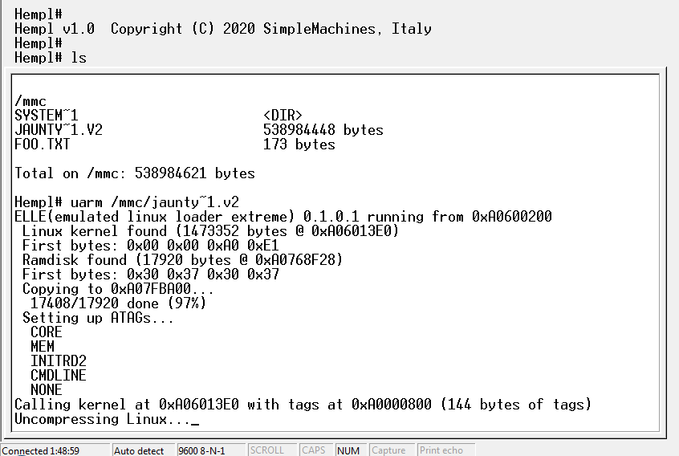

# uarm_pxa255_xmc4500
Dimitry's uARM (for PXA-255 Jaunty) on XMC4500-E144x1024

This is an Infineon DAVE project. It is a port of the uARM emulator
for the XMC4500. It was specifically revived/updated to see if the
recent FATFS 0.13C patches work.  Here is s screenshot of PXA-255
Linux booting on the XMC4500.

